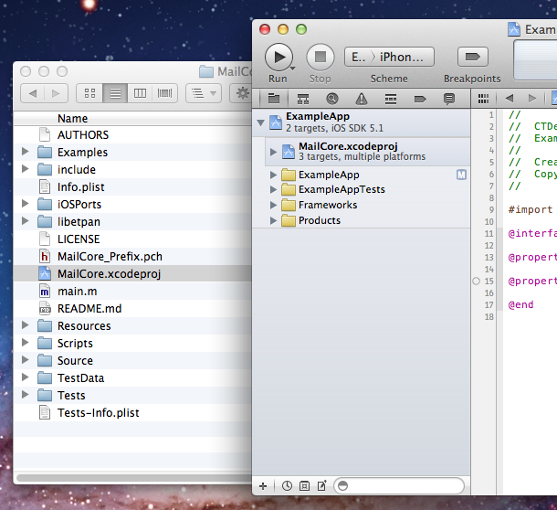
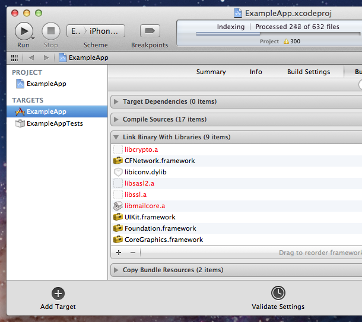

# MailCore
MailCore is a Mac/iOS framework for working with the e-mail protocols IMAP and SMTP

***

## Summary

* [What is MailCore?][whatis]
* [Getting the Code][gettingcode]
* [Adding MailCore to Your iOS Project][iosadding]
* [Adding MailCore to Your Mac Project][macadding]
* [Migrating to Version 1.0][migrating]
* [Documentation][docs]
* [Mailing List][mailinglist]
* [Apps Using MailCore][apps]
* [Consulting][consulting]
* [Contact][contact]

***

## What is MailCore? [whatis]

MailCore is a Mac and iOS framework designed to ease the pain of dealing with e-mail protocols. MailCore makes the process of sending e-mail easy by hiding the nasty details like MIME composition from you. Instead, there is a nice interface for composing messages and then there is a single method required to send the message. Checking e-mail on an IMAP server is a more complex beast, but MailCore makes the job much simpler but presenting everything as a set of abstract objects like Messages, Folders and Accounts.

## Getting the Code [gettingcode]

The best way to get MailCore is to clone directly from [GitHub](http://www.github.com/mronge/MailCore/). The master branch is under active development but it is still the recommended place to start. Eventually a stable version will be tagged 1.0, but for now work off master.

~~~~~bash
git clone https://github.com/mronge/MailCore.git
cd MailCore/
git submodule update --init
~~~~~

##  Adding MailCore to Your iOS Project [iosadding]

1. First checkout the latest code and make sure you get the required submodules
2. Locate MailCore.xcodeproj and add it to your project as a subproject. You can do this by dragging the Mailcore.xcodeproj file into your Xcode project.

3. Navigate to your app's target and switch to your app's Build Phases. Once in Build Phases expand "Link Binary With Libraries" and click the + button. And add these libraries:

~~~~~text
   libmailcore.a
   libssl.a
   libsasl2.a
   libcrypto.a
   libiconv.dylib
   CFNetwork.framework
~~~~~ 

4. Add "MailCore iOS" under "Target Dependencies"
5. Under your app's target, switch to Build Settings. Locate "Header Search Paths" in the Build Settings and add `"$(BUILT_PRODUCTS_DIR)/../../include"`
6. You are now ready to use MailCore. To use MailCore add `#import <MailCore/MailCore.h>` to the top of your Objective-C files.

##  Adding MailCore to Your Mac Project [macadding]

1. First checkout the latest code and make sure you get the required submodules
2. Locate MailCore.xcodeproj and add it to your project as a subproject. You can do this by dragging the Mailcore.xcodeproj file into your Xcode project.
3. Navigate to your app's target and switch to your app's Build Phases. Once in Build Phases expand "Link Binary With Libraries" and click the + button. From there add MailCore.framework.
4. While still under Build Phases click "Add Build Phase" in the lower right and select "Add Copy Files". A new copy files phase will be added, make sure the destination is set to "Frameworks". Now add MailCore.framework to that copy files phase by using the + button.
5. Add "MailCore" under "Target Dependencies"
6. You are now ready to use MailCore. To use MailCore add `#import <MailCore/MailCore.h>` to the top of your Objective-C files.

## Migrating to Version 1.0 [migrating]

The latest version of MailCore is no longer backwards compatible with earlier versions. I tried to keep backwards compatibility, but it became too complex, sorry :(

The biggest change is that exceptions are no longer used. Instead each method either returns a BOOL or an object that can be checked for success. If an error occurs each object has a `- (NSError *)lastError` method that can be consulted.

Here are a list of major changes:

* The method `- (int)fetchBody` has been renamed to `- (BOOL)fetchBodyStructure`
* The methods `messageObjectsFromIndex:toIndex:` and `messageListWithFetchAttributes:` have both been removed. They've been replaced by the new and improved `messagesFromSequenceNumber:to:withFetchAttributes:` and `messagesFromUID:to:withFetchAttributes:`. Please see the header file CTCoreFolder.m for details.
- NSException is no longer used, instead NSError is used.
- A CTCoreMessage's to, from, sender, bcc, cc, and subject values are nil when they have not been downloaded or message doesn't have them
- Message UIDs are now NSUIntegers instead of NSStrings
- `- (BOOL)isUIDValid:(NSString *)uid` has been removed. Instead check your uid validity value manually

## Documentation [docs]

Begin with the [Getting Started Guide](gettingstarted.html) and then take a look at the [API docs](api/index.html).

## Mailing List [mailinglist]

There is a low traffic mailing list hosted on [Librelist](http://librelist.com/).

* To join send an email to <mailcore@librelist.com> and reply to the confirmation e-mail. To unsubscribe at anytime send an e-mail to <mailcore-unsubscribe@librelist.com>.
* Mailing list archives are [available.](http://librelist.com/browser/mailcore/)

## Apps Using MailCore [apps]

If you'd like your app listed here, please get in touch.

* Fileboard
* CloudPull
* Remail
* Notify
* FwdMail
* eMailGanizer
* OneMail
* MailArchive
* iPhoto2Gmail

## Consulting [consulting]

Consulting services are available via [Central Atomics](http://www.centralatomics.com). At Central Atomics we have over 10 years of experience developing for Apple platforms and 6 years of experience working with e-mail systems. If you need custom e-mail functionality developed, please get in touch via our website or e-mail Matt directly.

## Contact [contact]

If you have any questions please don't hestitate to contact me at <mronge@mronge.com> or on Twitter at [@mronge](http:www.twitter.com/mronge).

Thanks,

Matt Ronge
